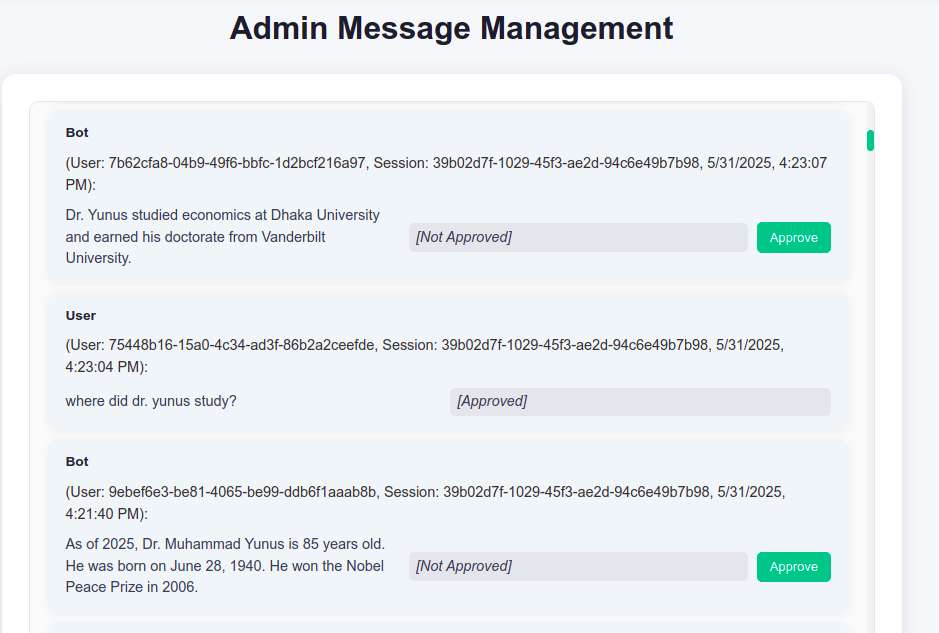
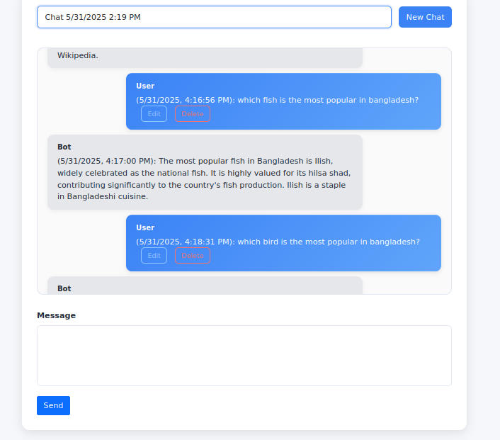
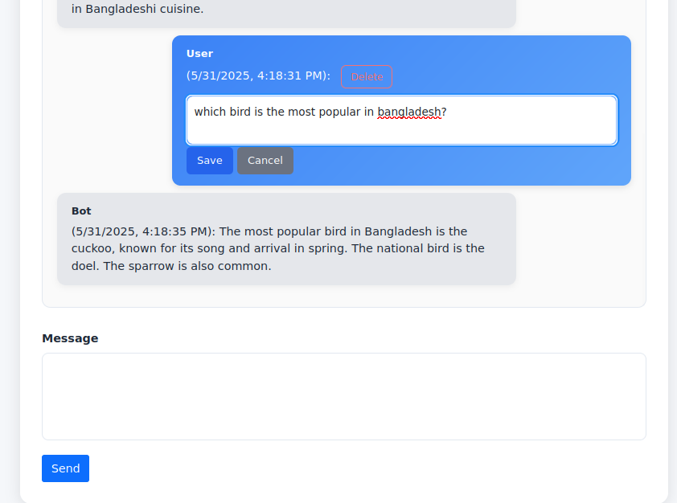

AI-Powered Real-Time Chatbot

## Overview

This is an AI-powered real-time chatbot web application built with ASP.NET Core Razor Pages, Entity Framework Core, SignalR, and ASP.NET Core Identity. The application allows users to interact with an AI chatbot powered by the Tavily AI API, manage chat sessions, edit or delete their messages, and synchronize conversations in real-time across multiple clients. Admins can view and approve all user messages through a dedicated interface. The project supports role-based authentication, ensuring secure access for users and administrators.

### Features

- **User Authentication**: Secure login and registration using ASP.NET Core Identity with role-based authorization (User and Admin roles).
- **Real-Time Messaging**: Send and receive messages instantly using SignalR, with automatic updates across all clients in the same session.
- **Session Management**: Users can create new chat sessions or switch between existing ones, with messages grouped by `SessionId`.
- **Message Editing and Deletion**: Users can edit or soft-delete their messages, with corresponding AI responses updated automatically.
- **Admin Interface**: Admins can view all messages from all users and approve unapproved messages via a dedicated Razor Page.
- **AI Integration**: Powered by the Tavily AI API for generating intelligent bot responses.
- **Responsive UI**: Built with Bootstrap for a clean, user-friendly interface.
- **Database Persistence**: Messages are stored in a SQL Server database using Entity Framework Core, with soft deletion and approval status tracking.

## Requirements

To run this project locally, ensure you have the following installed:

- **.NET SDK**: Version 8.0.404
- **SQL Server**: MSSQL
- **Tavily AI API Key**: Required for AI responses. Sign up at Tavily to obtain an API key.
- **Git**: For cloning the repository (Download)

## Setup Instructions

1. **Clone the Repository**:

   ```bash
   git clone https://github.com/Irteja/Real-Time-Chatbot.git
   ```

2. **Configure the Database**:

   - Update the connection string in `appsettings.json` to point to your SQL Server instance:

     ```json
     "ConnectionStrings": {
       "DefaultConnection": "Server=localhost;Database=AiPoweredChatAppDb;User Id=your-user-name;Password=your-password;TrustServerCertificate=True;"
     }
     ```
   - Apply Entity Framework Core migrations to create the database:

     ```bash
     dotnet ef database update
     ```

3. **Configure Tavily AI API Key**:

   - Add your Tavily API key to `appsettings.json`:

     ```json
     {
      "Tavily": {
        "ApiKey": "your-api-key"
      }
     }
     ```

4. **Install Dependencies**:

   - Restore NuGet packages:

     ```bash
     dotnet restore
     ```

5. **Run the Application**:

   - Start the application:

     ```bash
     dotnet run
     ```


## Usage

- **User Features**:

  - Log in or register at `/Account/Login` or `/Account/Register`.
  - Access the chat interface at `/Chat`.
  - Create a new chat session with the "New Chat" button or select an existing session from the dropdown.
  - Send messages to interact with the AI chatbot, edit or delete your messages, and view real-time updates.

- **Admin Features**:

  - Log in as an admin user.(mail:"admin@example.com",password:"Admin@123!")
  - Access the admin interface at `/AdminPanel`.
  - View all messages from all users, including their approval status.
  - Approve unapproved messages with the "Approve" button.

## Project Structure

```
├── AiPoweredRealTimeChatBot.csproj
├── appsettings.Development.json
├── Areas
│   └── Identity
│       └── Pages
│           ├── Account
│           │   ├── Login.cshtml
│           │   ├── Login.cshtml.cs
│           │   ├── Logout.cshtml
│           │   ├── Logout.cshtml.cs
│           │   ├── Register.cshtml
│           │   ├── Register.cshtml.cs
│           │   └── _ViewImports.cshtml
│           ├── _ValidationScriptsPartial.cshtml
│           ├── _ViewImports.cshtml
│           └── _ViewStart.cshtml
├── Controllers
│   └── ChatController.cs
├── Data
│   └── AiPoweredChatAppDbContext.cs
├── Dtos
│   ├── AdminMessageDtos.cs
│   ├── EditMessageRequestDtos.cs
│   ├── InputModelDtos.cs
│   ├── SendMessageRequestDtos.cs
│   └── SignUpUserDtos.cs
├── Hubs
│   └── ChatHub.cs
├── Migrations
│   ├── 20250531061925_InitialCreate.cs
│   ├── 20250531061925_InitialCreate.Designer.cs
│   └── AiPoweredChatAppDbContextModelSnapshot.cs
├── Models
│   ├── ChatMessage.cs
│   └── User.cs
├── Pages
│   ├── AdminPanel
│   │   ├── Index.cshtml
│   │   └── Index.cshtml.cs
│   ├── chat
│   │   ├── Index.cshtml
│   │   └── Index.cshtml.cs
│   ├── Error.cshtml
│   ├── Error.cshtml.cs
│   ├── Index.cshtml
│   ├── Index.cshtml.cs
│   ├── Shared
│   │   ├── _Layout.cshtml
│   │   ├── _Layout.cshtml.css
│   │   ├── _LoginPartial.cshtml
│   │   └── _ValidationScriptsPartial.cshtml
│   ├── _ViewImports.cshtml
│   └── _ViewStart.cshtml
├── Program.cs
├── Properties
    └── launchSettings.json

```

- **Pages/Chat/Index.cshtml**: Main user chat interface with session management, message sending, editing, and deletion.
- **Pages/AdminPanel/Index.cshtml**: Admin interface for viewing and approving all messages.
- **Controllers/ChatController.cs**: API endpoints for sending, editing, deleting, approving messages, and fetching history.
- **Hubs/ChatHub.cs**: SignalR hub for real-time messaging.
- **Models/ChatMessage.cs**: Entity model for chat messages with properties like `Id`, `UserId`, `SessionId`, `IsApproved`.
- **Dtos/**: Data transfer objects for API requests and responses.
- **Data/ApplicationDbContext.cs**: Entity Framework Core context for database operations.
- **appsettings.json**: Configuration for database connection and Tavily API key.


## 📸 Screenshots

### Admin Panel
Admin can approve the message that has generated by the ai.After getting approval user will be able see the ai response.


---

### User Interface
User can send message to ai,edit their previous messages and can also delete their previous messages



---

## API Endpoints

- **POST /api/chat/send**: Send a new message and get an AI response.
- **PUT /api/chat/{id}**: Edit a user message and update the AI response.
- **DELETE /api/chat/{id}**: Soft-delete a user message and its corresponding AI response.
- **PATCH /api/chat/{id}/approve**: Approve a message (admin only).
- **GET /api/chat/sessions**: Get user’s chat sessions.
- **GET /api/chat/history**: Get message history for a user’s session.
- **GET /api/chat/admin/history**: Get all messages for admin.


